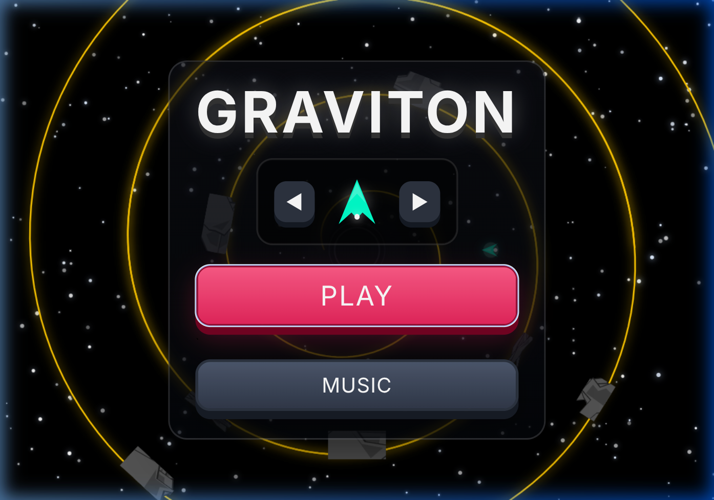
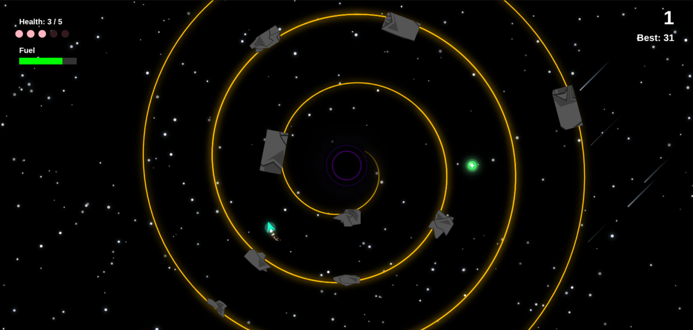
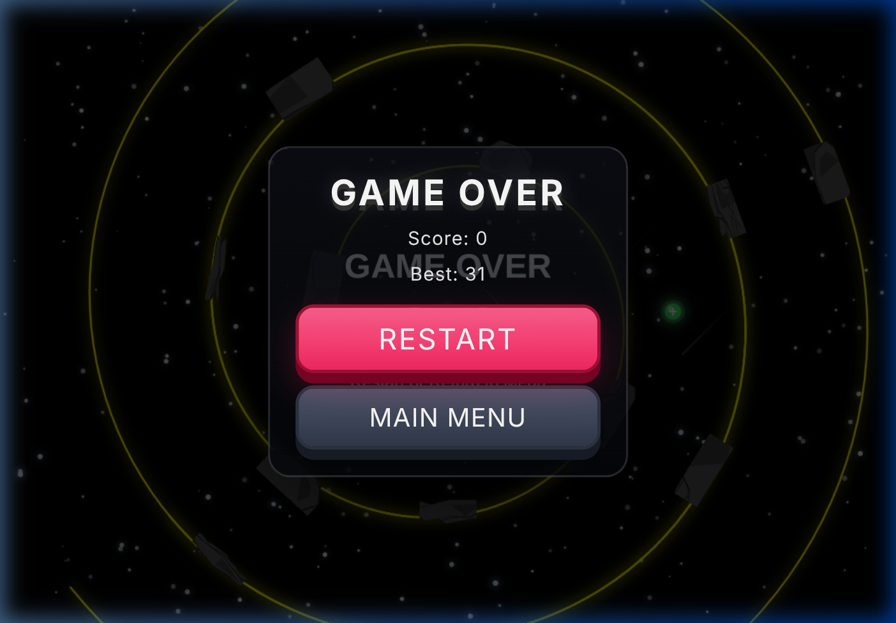
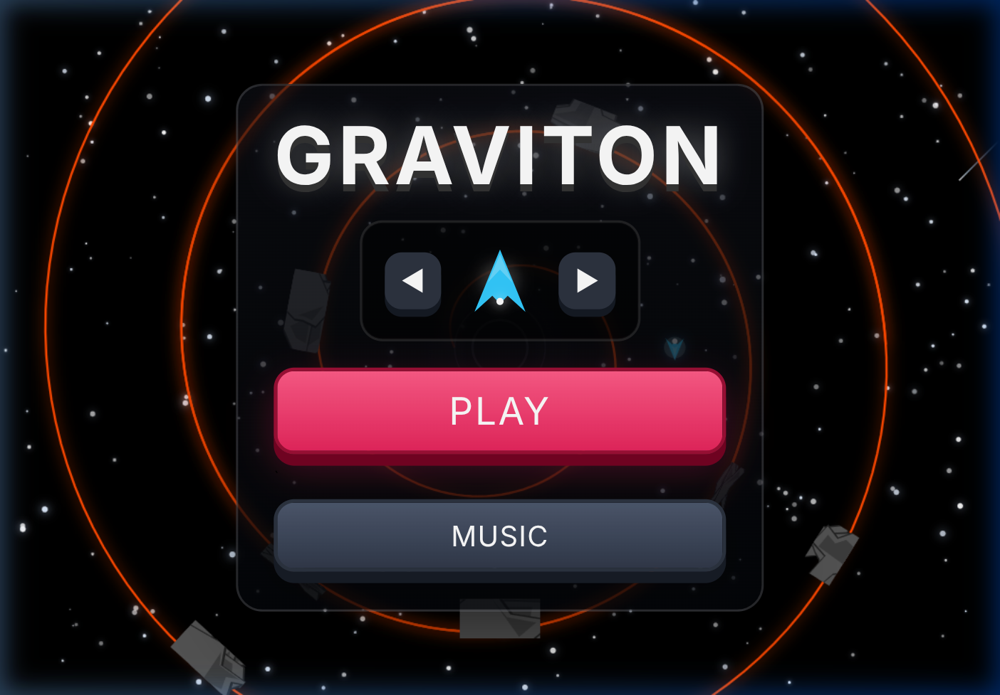
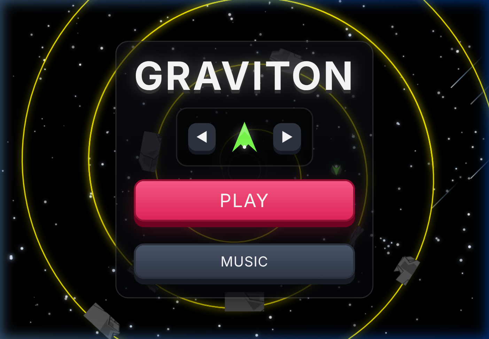
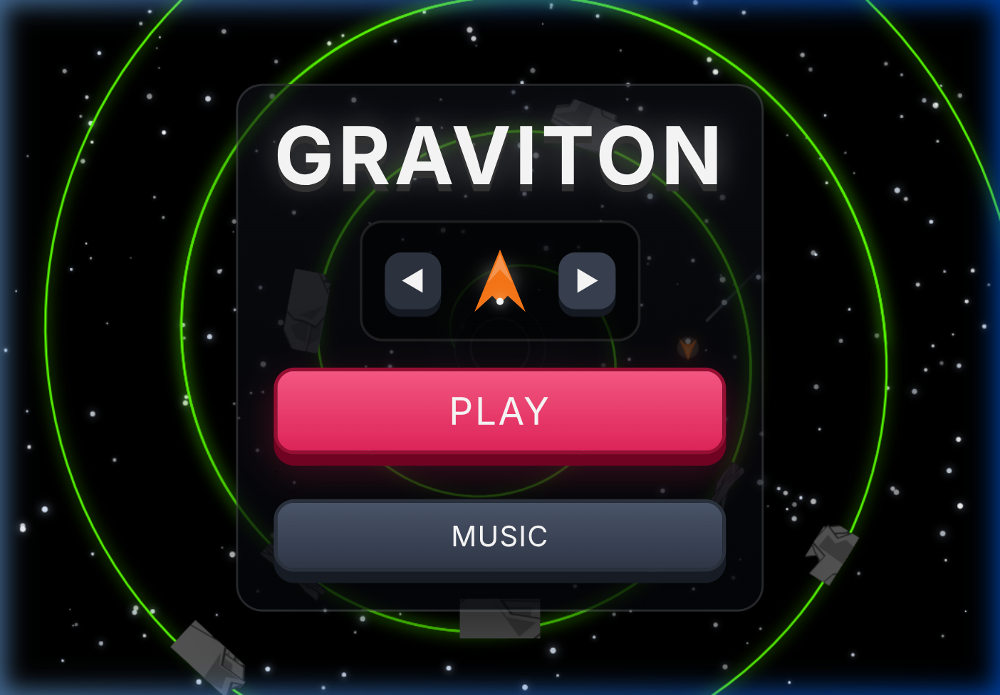
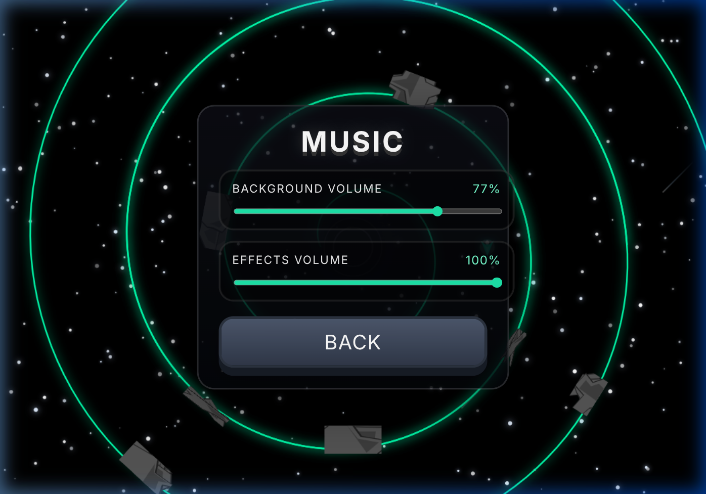
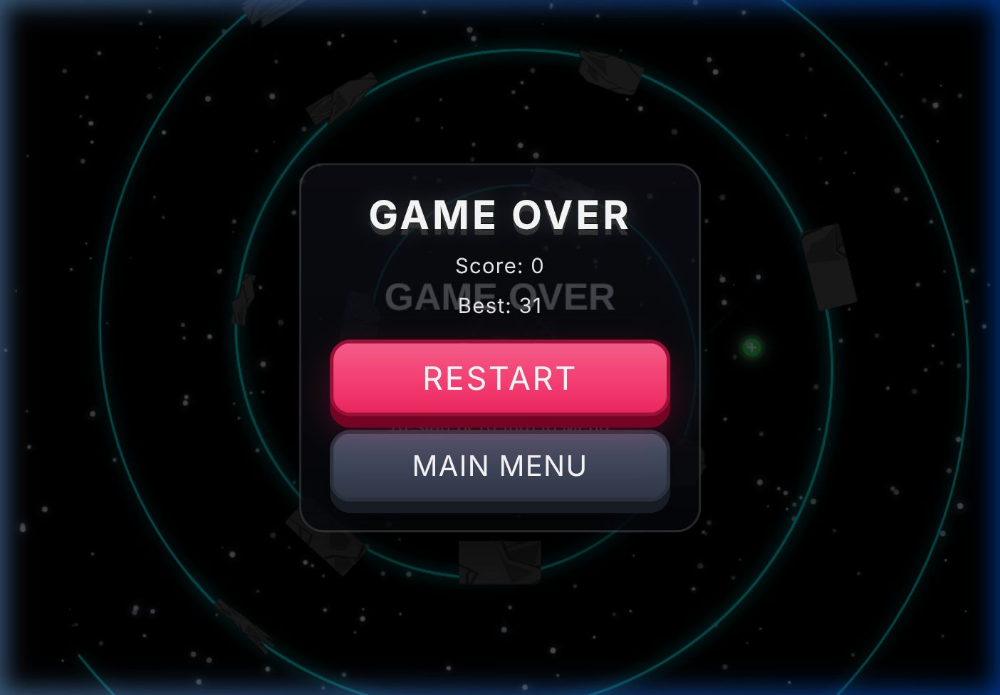

<h1 align="center">GRAVITON</h1>

<p align="center">
  
</p>

<p align="center">
  <b>A fast-paced, gravity-defying arcade runner built with pure HTML5 Canvas and JavaScript.</b><br>
  Navigate a spiraling tunnel around a black hole, dodge procedurally generated asteroids, and survive as long as you can.
</p>

<p align="center">
  <a href="#features">Features</a> •
  <a href="#how-to-play">How to Play</a> •
  <a href="#game-mechanics">Game Mechanics</a> •
  <a href="#screenshots">Screenshots</a> •
  <a href="#tech-stack">Tech Stack</a> •
  <a href="#getting-started">Getting Started</a>
</p>

---

## Features

### 🎮 Core Gameplay
- **Spiral Tunnel Navigation** — Fly through an ever-expanding Archimedean spiral, tapping to flap against gravity
- **Procedural Asteroid Obstacles** — Each asteroid is a unique 6–10 sided irregular polygon, procedurally generated for endless variety
- **Drifting Asteroids** — Obstacles dynamically slide their gaps using sine wave oscillation, making navigation unpredictable
- **Fixed-Timestep Physics** — Consistent 60 FPS physics with catch-up logic to prevent frame-rate-dependent behavior

### AI Director (Dynamic Difficulty)
A hidden **AI Director** drives difficulty in real-time using a stress level (0.0–1.0):

| Behavior | Effect |
|---|---|
| **Flawless flying** | Stress slowly increases (+0.0003/tick) |
| **Taking damage** | Stress drops by 40% instantly |
| **Higher stress** | Faster scroll speed, tighter gaps, more drifting asteroids |
| **Lower stress** | Wider gaps, slower scrolling, fewer drifters |

This creates an adaptive experience — the game pushes harder the better you play, but eases up when you struggle.

### Screen Shake & Hit Stop
- **Hit Stop** — Physics freeze for 8 frames on damage, creating a punchy impact feel
- **Screen Shake** — Canvas randomly rattles on damage (10px intensity) and death (25px intensity), decaying smoothly

### Health System



- Start with **3 HP** out of a maximum of **5 HP**
- Health is displayed as pink heart bubbles on the HUD
- **Health pickups** (green cross icons) spawn randomly in the tunnel
- **Invincibility frames** protect you briefly after taking damage

### Fuel System
- Every flap costs **2 fuel** from a 100-unit tank
- Fuel drains at **0.1/tick** passively
- When fuel drops below 25%, a **low fuel warning** sounds
- **Fuel pickups** spawn at regular intervals along the spiral
- Running out of fuel = instant death

### Time-Stop Boost
- Collecting a **diamond pickup** activates a **5-second time freeze**
- The entire world freezes — scrolling stops, gravity disappears
- An **autopilot** takes over, steering the ship through the next gap
- A blue **Boost bar** appears on the HUD showing remaining duration

### Black Hole



- A massive **black hole** sits at the center of the spiral
- Features a multi-layered radial gradient that absorbs light
- **Purple accretion rings** pulse around the event horizon
- When your ship dies, it spirals into the black hole with a death fall animation

### 🎨 Ship Customization

<p>
  
  
  
</p>

Choose from **12 vibrant ship colors** on the main menu:
- Teal, Hot Pink, Yellow, Purple, Sky Blue, Lime
- Orange, Salmon, Electric Blue, Gold, Lavender, White

Use the **◀ ▶ arrows** on the main menu to browse all options.

### Audio System



- **Background Music** with adjustable volume slider (0–100%)
- **Sound Effects Volume** slider (0–100%) — independently control flap, collision, pickup, and death sounds
- All audio uses the **Web Audio API** for procedurally generated sound effects
- Volume preferences are saved to `localStorage`

### Space Background
- **280 procedural stars** with per-star twinkle animation at unique frequencies
- Stars have a subtle glow effect that pulses at different rates
- **Shooting meteors** streak across the sky (up to 5 simultaneously)
- Deep space gradient background with a parallax feel

### Scoring & Persistence
- Score one point for each obstacle safely passed
- **High score** is saved to `localStorage` and persists across sessions
- Score displays on the **top-right** during gameplay, with your best score below it

### Game Over



- Dramatic **death fall animation** — your ship spirals into the black hole
- Screen fades to black with final score and best score displayed
- **RESTART** for quick retry or **MAIN MENU** to return to the title

---

## How to Play

| Action | Control |
|---|---|
| **Flap (fly upward)** | Click, tap, or press `Space` |
| **Navigate menus** | Click buttons |
| **Change ship color** | Click ◀ ▶ arrows on main menu |

**Tips:**
- Tap in short bursts — holding too long wastes fuel
- Aim for the center of gaps, especially when asteroids drift
- Watch your fuel gauge — pickups appear at regular intervals
- Time-stop boosts are rare and valuable — they can save a run
- The game gets harder the better you play — if you take a hit, difficulty backs off

---

## Game Mechanics

### Difficulty Scaling
Difficulty increases through two independent systems:

1. **Ring-Based Stages** — Every 5 full rotations around the spiral triggers a new difficulty stage:
   - Scroll speed increases by 10% per stage
   - Obstacle gaps shrink
   - Asteroid complexity increases (more polygon detail)
   - Obstacle spacing tightens

2. **AI Director Stress** — Overlays on top of ring-based difficulty:
   - Scroll speed bonus up to +0.025
   - Gap reduction from base down to 55px minimum
   - Drift probability up to 85%
   - Obstacle spacing tightens by up to 30%

### Physics
- **Gravity**: 0.2 units/tick downward
- **Flap Strength**: 4.5 units velocity burst
- **Tunnel Width**: 180 units
- **Collision detection**: ±0.05 radian window at each obstacle

---

## Screenshots

| Screen | Description |
|---|---|
|  | **Main Menu** — Title screen with ship selector and action buttons |
|  | **Audio Settings** — Independent volume sliders for music and effects |
|  | **Gameplay** — Health bubbles, fuel bar, score, and asteroid obstacles |
|  | **Game Over** — Death spiral, final score, and navigation options |
|  | **Black Hole** — Purple accretion rings around the central void |

---

## Tech Stack

| Layer | Technology |
|---|---|
| **Rendering** | HTML5 Canvas 2D |
| **Language** | Vanilla JavaScript (ES Modules) |
| **Audio** | Web Audio API (procedural synthesis) |
| **Styling** | CSS3 (glassmorphism, gradients) |
| **Storage** | localStorage (high scores, audio settings) |
| **Bundling** | None — zero dependencies, runs directly in browser |

---

## Project Structure

```
Graviton/
├── index.html          # Entry point
├── style.css           # UI styles (menus, overlays, sliders)
├── README.md           # This file
├── screenshots/        # Game screenshots
│   ├── main_menu.png
│   ├── music_menu.png
│   ├── gameplay_hud.png
│   ├── game_over.png
│   ├── black_hole.png
│   ├── ship_teal.png
│   ├── ship_lime.png
│   └── ship_orange.png
└── js/
    ├── main.js         # Game loop, physics, fixed-timestep engine
    ├── state.js        # Game state, damage, AI Director stress
    ├── renderer.js     # Canvas rendering (spiral, asteroids, HUD, stars)
    ├── obstacles.js    # Obstacle generation, drifting, collision detection
    ├── particles.js    # Trail sparkles and burst effects
    ├── pickups.js      # Health, fuel, and boost pickup logic
    ├── input.js        # Input handling, menu management, UI
    ├── audio.js        # Sound effects and background music
    ├── config.js       # All game constants and tuning parameters
    └── utils.js        # Helper functions (spiral math, difficulty)
```

---

## Getting Started

```bash
# Clone the repository
git clone https://github.com/Noaman-Akhtar/Graviton.git
cd Graviton

# Start a local server (any of these work)
python3 -m http.server 8080
# or
npx serve .
# or
npx http-server .

# Open in browser
open http://localhost:8080
```

> **Note:** The game must be served over HTTP due to ES Module imports. Opening `index.html` directly won't work.

---

## Performance

The game is optimized for smooth 60 FPS gameplay:

- **Fixed-timestep** physics engine prevents frame-rate-dependent behavior
- **Particle system** uses O(1) compaction instead of O(n) splice operations
- **Star twinkle** rendering uses threshold-based skip to avoid unnecessary draw calls
- **Canvas state** management batches `save/restore` calls for efficiency
- **Zero dependencies** — no build step, no framework overhead

---

